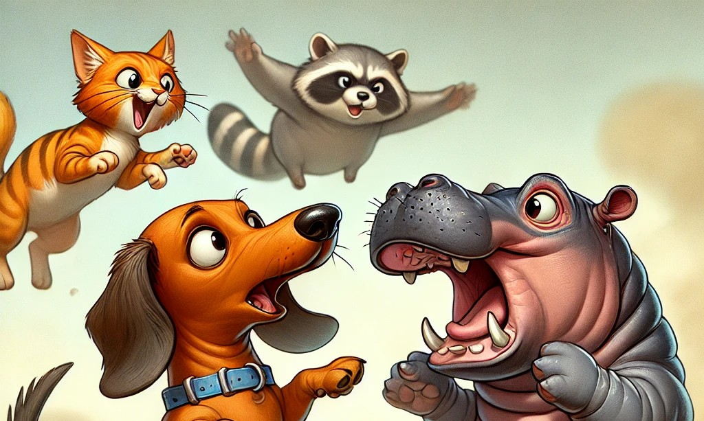
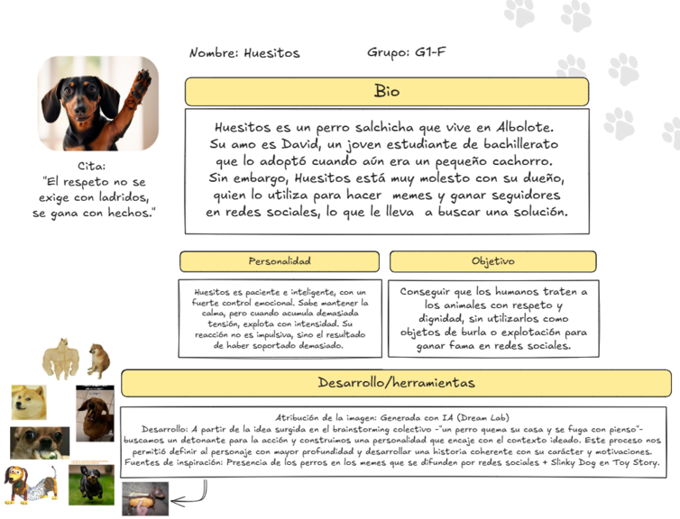
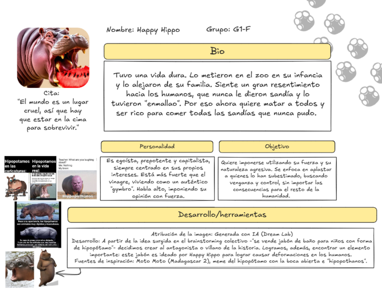
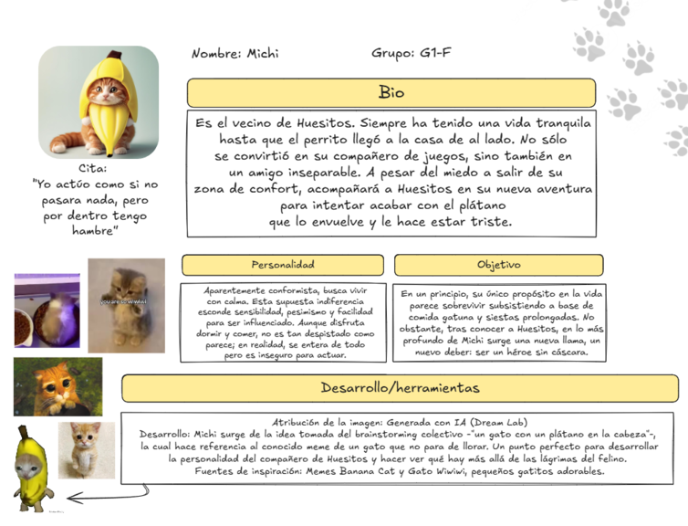
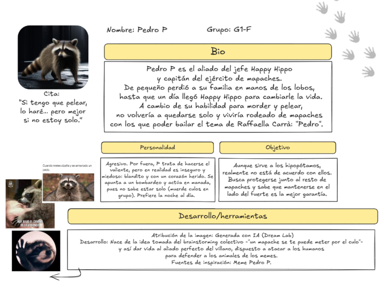
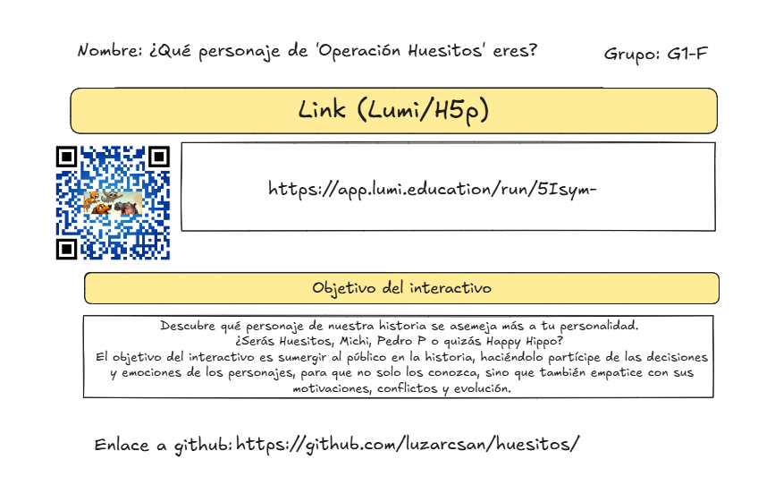

# Proyecto Storytelling: 
### my_storytelling_G1
Plantilla para crear mi historia interactiva de la asignatura [Creatividad e innovación Audiovisual](https://www.ugr.es/estudiantes/grados/grado-comunicacion-audiovisual/creacion-difusion-nuevos-contenidos-audiovis), repositorio de proyectos y documentación en https://github.com/mgea/storytelling

# *Operación Huesitos*

Autores:  
<!---
Incluir lista de personas del grupo 
Se puede añadir enlace a página personal de github o lo que se quiera...(optativo)
-->

- 👩: Luz Arcos Sánchez
- 🦋: Andrea Armada Ruiz
- 🙇‍♂️: Nacho Martínez Torrero
- 👨: Miguel Velasco García 

Proyecto (código): G1F

URL (link) del proyecto en Github: https://github.com/luzarcsan/huesitos/

Tipo/Género:  
- [x] FictionCiberpunk  
- [ ] Reality/tribus urbanas  
- [ ] Comic

### Sinopsis
*Operación Huesitos* narra la valiente historia de Huesitos, un perro salchicha que decide cambiar su vida y rebelarse contra los memes que su dueño crea sobre él. Junto a su fiel amigo Michi, Huesitos inicia una aventura épica que desata una guerra entre animales y humanos que se burlan de ellos. Sin embargo, detrás de esta rebelión se esconde una amenaza aún mayor: el temible jefe Happy Hippo y su ejército de mapaches, quienes planean destruir la sociedad humana para dominar el mundo.

### Personajes

#### Huesitos 🐕

#### Happy Hippo 🦛

#### Michi 🐈

#### Pedro P 🦝

### Historia

### TagLine
*El destino del mundo🗺️ está en patas muy pequeñas🌭*

### Conflicto 
Cansado de ser el hazmerreír en memes virales, Huesitos se levanta contra su dueño y enciende la chispa de una rebelión animal. Pero lo que empieza como una lucha por dignidad, pronto revela algo más oscuro: Happy Hippo, un villano oculto, planea usar el caos para apoderarse del mundo con su ejército de mapaches entrenados.

### Productos

- Quiz de personalidad: 

¡Descubre qué personaje de *Operación Huesitos* eres! https://app.lumi.education/run/5Isym-

- Teaser interactivo:
¡Navega por el móvil de Huesitos!:
🖱️ [Ya disponible en Figma](https://www.figma.com/proto/dXbGgSGtlxjZm1pu5S7b7i/IGNACIO-MARTINEZ-TORRERO-s-team-library?node-id=3314-3239&p=f&t=wNQEOfQyfM9oL4AC-1&scaling=scale-down&content-scaling=fixed&page-id=0%3A1&starting-point-node-id=3314%3A3239&show-proto-sidebar=1)

- Juega con nosotros en ArcWeave :video_game::
Capítulo 1 - [El meme que colmó el plato](https://arcweave.com/app/project/gk6QqR46dK)

- Novela visual en RenP'y 🖥️
  
### Conclusiones/Valoración del equipo
La elaboración de nuestra novela visual supone el cierre del proyecto *Operación Huesitos* como parte de la asignatura Creatividad e Innovación Audiovisual. Hemos dado un paso importante en la comprensión de la construcción y el desarrollo de narrativas interactivas en entornos digitales. Esta práctica no solo ha implicado la creación de uno de los capítulos a través de Ren'Py, sino también toda una ideación en torno al diseño de un videojuego, tomando en cuenta aspectos fundamentales en la creación de la atmósfera como el sonido o la música. A su vez, la generación de imágenes a través de Inteligencia Artificial ha sido otro reto que, aunque finalmente nos ha permitido obtener un resultado estético uniforme y satisfactorio, ha implicado una gran implicación en los prompts y un proceso de acierto, error y corrección. Como grupo, nos impresiona el resultado obtenido a partir de aquella tormenta de ideas colectiva en Miro. Desde ahí, fuimos construyendo un universo narrativo desde ideas aparentemente inconexas, que ahora combinan combina humor, crítica social y estética visual, todo pensado para generar una experiencia inmersiva.

Durante este proceso, hemos aprendido a integrar distintas herramientas digitales con objetivos específicos: ArcWeave para crear prototipos, planificar y diseñar historias no lineales y narrativas interactivas; Figma para el diseño visual y la interfaz de usuario en una sociedad que siempre está acompañada de su teléfono móvil; Character AI para el desarrollo de diálogos y perfiles más ricos a partir de un chat; H5P para elementos interactivos complementarios como pequeños minijuegos y tests de personalidad; y GitHub como repositorio y entorno colaborativo en el que compartir nuestra historia. Cada una de estas herramientas nos ha aportado no solo una funcionalidad concreta, sino también una nueva perspectiva sobre cómo se pueden combinar tecnología y creatividad para lograr que los proyectos tengan mucho mayor potencial y alcance.

*Operación Huesitos* nos ha enfrentado a retos técnicos, narrativos y organizativos, pero también nos ha impulsado a repensar las formas tradicionales de contar historias. En un contexto en el que la audiencia ya no se conforma con consumir contenido, sino que desea participar activamente en él e incluso intervenir en el desarrollo de los acontecimientos, este tipo de experiencias nos preparan para idear formatos híbridos e innovadores que pueden aplicarse a campos tan diversos como la publicidad, la educación, el marketing digital, las redes sociales o la creación de contenidos transmedia.

En definitiva, consideramos que este trabajo ha sido mucho más que una práctica académica, coformándose como un laboratorio creativo en el que hemos desarrollado habilidades técnicas, un espíritu colaborativo y, sobre todo, una nueva sensibilidad hacia el storytelling digital. Valoramos profundamente este proceso como una experiencia formativa integral que nos prepara para afrontar con mayor solidez los desafíos creativos y profesionales del presente, pero también del futuro.

------

<!---
Lista completa de emojis de markDown - https://gist.github.com/rxaviers/7360908) 
-->

Marzo, 2025

Proyecto dentro de la serie [Narrativas interactivas](https://github.com/mgea/storytelling/blob/master/What_is_a_digital_storytelling.md) 
Proyectos seleccionados de [2023](https://github.com/mgea/storytelling/tree/master/2023), [2022](https://github.com/mgea/storytelling/blob/master/2022/readme.md) / [2021](https://github.com/mgea/storytelling/blob/master/2021/readme.md) / [2020](https://github.com/mgea/storytelling/blob/master/2020/readme.md)  / 
[2019](https://github.com/mgea/storytelling/blob/master/2019/readme.md) / [2018](https://github.com/mgea/storytelling/blob/master/2018/readme.md) 

CC BYNCSA [Creatividad e Innovación Audiovisual-B](https://github.com/mgea/criav/)

 

[Facultad de Comunicación y Documentación](http://fcd.ugr.es)

Universidad de Granada
