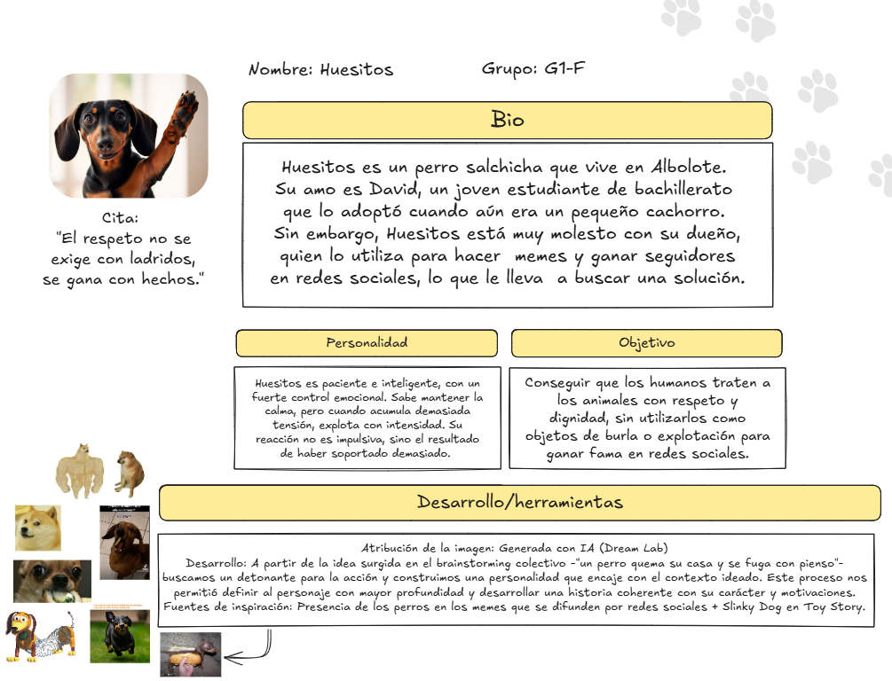
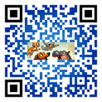

# Proyecto Storytelling (template): 
### my_storytelling_G1
Plantilla para crear mi historia interactiva de la asignatura [Creatividad e innovación Audiovisual](https://www.ugr.es/estudiantes/grados/grado-comunicacion-audiovisual/creacion-difusion-nuevos-contenidos-audiovis), repositorio de proyectos y documentación en https://github.com/mgea/storytelling

Autores:  
<!---
Incluir lista de personas del grupo 
Se puede añadir enlace a página personal de github o lo que se quiera...(optativo)
-->

- 👩: Luz Arcos Sánchez
- 🦋: Andrea Armada Ruiz
- 🙇‍♂️: Nacho Martínez Torrero
- 👨: Miguel Velasco García 

Proyecto (código): G1F
URL (link) del proyecto en Github: 

Tipo/Género:  
- [x] FictionCiberpunk  
- [ ] Reality/tribus urbanas  
- [ ] Comic

## Resumen
(sinopsis de 80-120 palabras máximo)

### Personajes
<!---
Habrá que redimensionar la foto de la ficha de Huesitos, quizás es un poco más grande de la cuenta, pero cuando ya tengamos todas las subimos en una misma dimensión
-->
#### Huesitos 🐕

#### Happy Hippo 🦛
#### Michi 🐈
#### Pedro P 🦝

### Historia

### TagLine

### Conflicto 

### Productos

- Quiz de personalidad: 

¡Descubre qué personaje de nuestra historia eres! https://app.lumi.education/run/5Isym-

- Banner/Teaser:  (enlace) 

- Storytelling: (enlace) 

### Conclusiones/Valoración del equipo

------

<!---
Lista completa de emojis de markDown - https://gist.github.com/rxaviers/7360908) 
-->

Marzo, 2025

Proyecto dentro de la serie [Narrativas interactivas](https://github.com/mgea/storytelling/blob/master/What_is_a_digital_storytelling.md) 
Proyectos seleccionados de [2023](https://github.com/mgea/storytelling/tree/master/2023), [2022](https://github.com/mgea/storytelling/blob/master/2022/readme.md) / [2021](https://github.com/mgea/storytelling/blob/master/2021/readme.md) / [2020](https://github.com/mgea/storytelling/blob/master/2020/readme.md)  / 
[2019](https://github.com/mgea/storytelling/blob/master/2019/readme.md) / [2018](https://github.com/mgea/storytelling/blob/master/2018/readme.md) 

CC BYNCSA [Creatividad e Innovación Audiovisual-B](https://github.com/mgea/criav/)

 

[Facultad de Comunicación y Documentación](http://fcd.ugr.es)

Universidad de Granada
